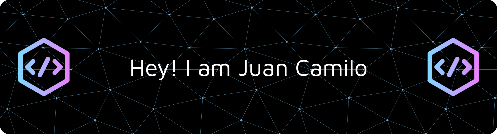

📍 Cali, Colombia  
📧 **Email:** jc.salazarquintero@gmail.com  
💼 [**LinkedIn**](https://www.linkedin.com/in/TU-LINKEDIN)  

---

## 🧑‍💻 Professional Profile

I am a Software developer with training in **software design, development, and architecture**, **data analysis**, and **machine learning**.    

I am passionate about **technological innovation**, problem-solving, and continuous learning.

---

# 💻 Tech Stack:
                                
# 📊 GitHub Stats:

---

<!-- Proudly created with GPRM ( https://gprm.itsvg.in ) -->
